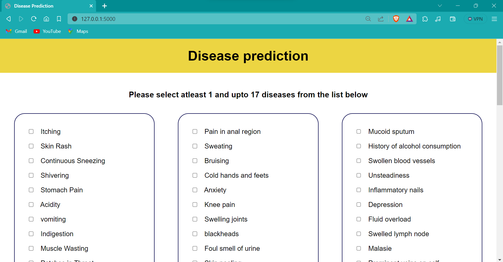

# Disease Prediction Website

## Overview

This is a disease prediction website built with Flask API. It uses machine learning models (random forest) to predict diseases based on various symptoms.



## Installation

1. Clone this repository to your local machine using:

```bash
git clone https://github.com/saha-indranil/ml-projects.git
```

2. Navigate to the project directory:

```bash
cd disease-prediction
```

3. Install the required dependencies using pip:

```bash
pip install -r requirements.txt
```

## Usage/Examples

1. Run the main.py using this command

```bash
python main.py
```

2.The web app will open in your browser on http://127.0.0.1:5000/
